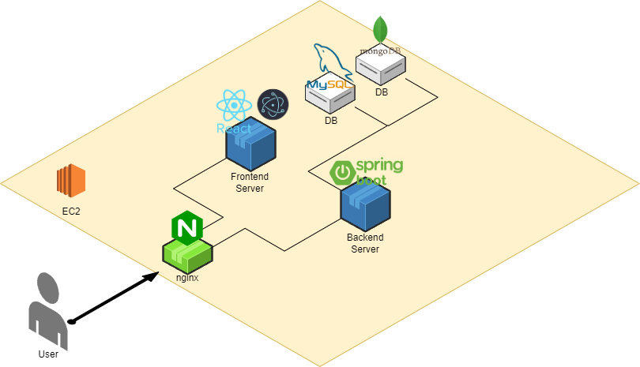

<h1 align="center">모각냥</h1>

## 목차
- [Member](#member)
- [Specification](#specification)
- [Introduction](#introduction)
- [Service Layout](#service-layout)
- [개발 환경](#개발-환경)
- [개발 기간 및 작업 관리](#개발-기간-및-작업-관리)
- [Refactoring](#refactoring)
- [프로젝트 후기](#프로젝트-후기)

-----

### Member

|            박은수             |           박도연            |             반주현             |                            백승윤                             |            이효리             |
|:----------------------------------------------------------:|:---------------------------------------------------------:|:-----------------------------------------------------------------:|:------------------------------------------------------------------------------------------:|:-

-----

### Specification

**시스템 아키텍쳐**
 

-----

### Introduction

---

### Service Layout

---

### 개발 환경

    <h3>Management Tool</h3>
    

        
        
        
        
        
    

    <h3>FrontEnd</h3>
    

        
        
        
        
        
        
        
        

    <h3>DB</h3>
    

        
        
        
    

    <h3>Infra </h3>
    

        
        
        
        
    

    <h3>IDE</h3>
    

        
        
    

---

### 개발 기간 및 작업 관리

#### **개발 기간**

---

### Refactoring

---

### 프로젝트 후기
